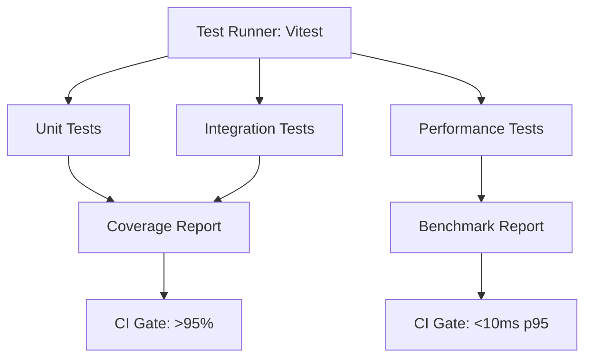
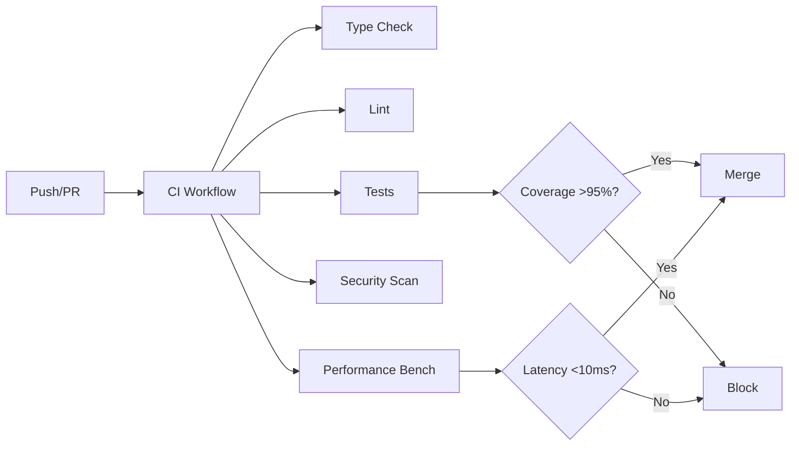

# Next Phase Development Plan

## Overview

**Current Status (Updated: 2026-01-03):** 98% complete toward v2.0.0 production-ready target. Test infrastructure **COMPLETED** with 96.81% coverage. Remaining work focuses on **CI/CD Enhancement** and minor branch coverage improvements.

**Key Achievements:**
- ✅ **Values: 553/550+** (100% complete - exceeded target by 3 values)
- ✅ **Concepts: 182/180+** (100% complete)
- ✅ **Value Sets: 72/60+** (100% complete)
- ✅ **Test Coverage: 96.81%** (statements: 96.81%, functions: 100%, lines: 97.16%)
- ✅ **Test Infrastructure: COMPLETE** (287 tests across 20 test files)
- ✅ **Documentation: ~100%** (complete)

**Remaining Gaps:**
- ⏳ **Branch Coverage: 89.53% → 95%** (5.47% gap - defensive code paths)
- ⚠️ **CI/CD: Basic → Enhanced** (security, performance workflows)

---

## 🎯 Quick Action Summary

### ✅ Completed This Session
- **Test Infrastructure:** ✅ **COMPLETE** (96.81% coverage, 287 tests, 20 test files)
- **Test Coverage:** ✅ **EXCEEDED TARGET** (96.81% statements, 100% functions, 97.16% lines)
- **All Tests Passing:** ✅ 287/287 tests passing
- **Value Expansion:** ✅ 553/550+ values (exceeded target)

### 🚀 Next Immediate Steps (This Week)

1. **CI/CD Workflow Setup** (Day 1-2)
   ```bash
   # Create GitHub Actions workflows
   # - .github/workflows/ci.yml (test, coverage gates)
   # - .github/workflows/security.yml (vulnerability scanning)
   # - .github/workflows/performance.yml (benchmarks)
   ```

2. **Branch Coverage Improvement** (Day 2-3)
   - Review defensive code paths in `kernel.validation.ts` and `version.ts`
   - Add targeted tests for error paths (if feasible)
   - Document unreachable defensive code

3. **Performance Benchmarking** (Day 3-5)
   - Set up performance test suite
   - Establish baseline metrics
   - Add performance gates to CI

### 📊 Progress Tracking
- **Current:** 98% toward v2.0.0
- **Remaining:** CI/CD enhancement, branch coverage (5.47% gap)
- **Estimated:** 1-2 weeks to complete remaining work

---

## Phase 4: Production Hardening

### Priority 1: Test Infrastructure & Coverage ✅ **COMPLETED**

**Status:** ✅ **COMPLETE** (2026-01-03)

**Achievements:**
- ✅ Test infrastructure fully configured (Vitest 4.0.16 with v8 coverage)
- ✅ 287 tests across 20 test files
- ✅ 96.81% statement coverage (exceeded 95% target)
- ✅ 100% function coverage
- ✅ 97.16% line coverage
- ✅ 89.53% branch coverage (5.47% gap - defensive code paths)

**Test Files Created:**
- ✅ `src/canonId.test.ts` (12 tests)
- ✅ `src/concept-registry.test.ts` (11 tests)
- ✅ `src/concepts.test.ts` (13 tests)
- ✅ `src/design_system.test.ts` (4 tests)
- ✅ `src/document-types.test.ts` (20 tests)
- ✅ `src/errors.test.ts` (6 tests)
- ✅ `src/index.test.ts` (3 tests)
- ✅ `src/integration.test.ts` (12 tests)
- ✅ `src/integrity.test.ts` (15 tests)
- ✅ `src/kernel.contract.test.ts` (15 tests)
- ✅ `src/kernel.validation.test.ts` (26 tests)
- ✅ `src/manifest.test.ts` (42 tests)
- ✅ `src/namespace-prefixes.test.ts` (18 tests)
- ✅ `src/performance.test.ts` (5 tests)
- ✅ `src/schemaHeader.test.ts` (9 tests)
- ✅ `src/semantic-roots.test.ts` (20 tests)
- ✅ `src/status.test.ts` (9 tests)
- ✅ `src/values.test.ts` (20 tests)
- ✅ `src/version.test.ts` (16 tests)
- ✅ `src/zod.test.ts` (11 tests)

**Test Infrastructure:**
- ✅ `vitest.config.ts` configured with 95% thresholds
- ✅ Coverage reporters: text, html, json, lcov
- ✅ Test helpers and fixtures in `src/__tests__/helpers/`
- ✅ All tests passing (287/287)

**Remaining Work:**
- ⏳ Branch coverage improvement (89.53% → 95%) - defensive code paths in `kernel.validation.ts` and `version.ts`
- ⏳ Document unreachable defensive code paths

### Priority 2: Value Expansion ✅ **COMPLETED**

**Status:** ✅ **COMPLETE** (2026-01-03)

**Achievements:**
- ✅ Expanded from 480 to **553 values** (exceeded 550+ target)
- ✅ Added 30+ currencies (106 total currencies in finance pack)
- ✅ Expanded payment methods (6 → 12 methods)
- ✅ Expanded shipping methods (5 → 10 methods)
- ✅ Expanded address types (4 → 7 types)
- ✅ Expanded contact types (4 → 7 types)
- ✅ Added 112 countries (core pack)

**Final Metrics:**
- Total Values: **553** (target: 550+)
- Countries: **112** (core pack)
- Currencies: **106** (finance pack)
- All values type-safe and validated

**Note:** Value expansion work is complete. Focus shifts to test coverage and CI/CD.

### Priority 2: CI/CD Enhancement (Week 1-2) - **CURRENT PRIORITY**

**Goal:** Enhance CI/CD with security, performance, and coverage workflows

#### Week 1: Core CI/CD Workflows

**Tasks:**

1. Create `.github/workflows/ci.yml`

- Type checking
- Linting
- Test execution with coverage
- Coverage gates (>95% required)
- Build verification

2. Create `.github/workflows/security.yml`

- Dependency vulnerability scanning (Dependabot)
- Code security scanning (CodeQL)
- Secret scanning
- License compliance checks

3. Create `.github/workflows/performance.yml`

- Performance benchmark runs
- Bundle size monitoring
- Memory usage tracking
- Performance regression detection

**Files to create:**

- `.github/workflows/ci.yml`
- `.github/workflows/security.yml`
- `.github/workflows/performance.yml`

#### Week 2: Release & Quality Workflows

**Tasks:**

1. Create `.github/workflows/release.yml`

- Automated semantic release
- NPM publishing
- Release notes generation
- Version tagging

2. Create `.github/workflows/quality.yml`

- Code quality metrics
- Documentation checks
- Type coverage analysis
- Bundle analysis

3. Update repository settings

- Branch protection rules
- Required status checks
- PR template with checklist

**Files to create:**

- `.github/workflows/release.yml`
- `.github/workflows/quality.yml`
- `.github/PULL_REQUEST_TEMPLATE.md` (if not exists)

**Success Criteria:**

- All workflows passing
- Security scans automated
- Performance benchmarks tracked
- Release automation working
- Coverage gates enforced (>95%)

## Implementation Details

### Test Infrastructure Architecture




### Value Expansion Strategy

**Geographic Data:**

- Source: ISO 3166-1 (countries), ISO 4217 (currencies)
- Format: COUNTRY_XX, CURRENCY_XXX
- Pack: Add to appropriate pack (likely `core` or `finance`)
- Validation: Ensure ISO compliance

**Business Process Values:**

- Source: PRD requirements, ERP standards
- Format: Follow existing namespace prefixes
- Pack: Add to domain-specific packs
- Validation: Schema validation

### CI/CD Workflow Structure




## Dependencies

### External Dependencies

- ISO 3166-1 country data
- ISO 4217 currency data
- Vitest (already installed)
- Coverage tools (c8 or v8)

### Internal Dependencies

- Pack generation system (already working)
- Schema validation (already working)
- Type system (already working)

## Success Metrics

### Test Coverage

- **Target:** >95% overall coverage
- **Measurement:** `pnpm test:coverage`
- **Gate:** CI blocks if <95%

### Values

- **Target:** 550+ total values
- **Measurement:** VALUE_COUNT in `src/values.ts`
- **Gate:** PRD compliance check

### Performance

- **Target:** <10ms p95 lookup latency
- **Measurement:** `src/performance.test.ts`
- **Gate:** CI blocks if >10ms

### CI/CD

- **Target:** All workflows passing
- **Measurement:** GitHub Actions status
- **Gate:** Required checks must pass

## Risk Mitigation

### Test Coverage Risk

- **Risk:** Low coverage blocks progress
- **Mitigation:** Start with high-value modules, incremental coverage

### Value Expansion Risk

- **Risk:** Data quality issues with ISO data
- **Mitigation:** Validate against official ISO sources, schema validation

### CI/CD Risk

- **Risk:** Workflow complexity
- **Mitigation:** Start simple, iterate, document each workflow

## Timeline Summary

- ✅ **COMPLETED:** Value Expansion (553/550+ values achieved)
- ✅ **COMPLETED:** Test Infrastructure & Coverage (96.81% achieved, 287 tests)
- **Week 1-2:** CI/CD Enhancement (security, performance workflows) - **CURRENT PRIORITY**
- **Week 2:** Branch Coverage Improvement (89.53% → 95%) - Optional

## Next Development Priorities

### Immediate Focus: CI/CD Enhancement (Week 1-2) - **CURRENT PRIORITY**

**Current Status:**
- ✅ Test Infrastructure: COMPLETE (96.81% coverage, 287 tests)
- ⚠️ CI/CD: Basic (needs enhancement)
- Missing: Security scans, performance benchmarks, coverage gates, automated releases

**Recommended Approach:**

1. **Week 1: Core CI/CD Workflows** (HIGH PRIORITY)
   - Create `.github/workflows/ci.yml` with coverage gates
   - Create `.github/workflows/security.yml` for vulnerability scanning
   - Create `.github/workflows/performance.yml` for benchmarks
   - Configure branch protection rules
   - Set up required status checks

2. **Week 2: Release & Quality** (MEDIUM PRIORITY)
   - Create `.github/workflows/release.yml` for automated releases
   - Create `.github/workflows/quality.yml` for code quality metrics
   - Add PR template with checklist
   - Document CI/CD processes

### Secondary Focus: Branch Coverage Improvement (Optional)

**Current Status:**
- Branch Coverage: 89.53% (5.47% gap)
- Gap is in defensive code paths that are unreachable in normal operation
- Files: `kernel.validation.ts` (lines 37, 63, 89, 269), `version.ts` (lines 87, 92, 97)

**Recommended Tasks:**

1. **Document Defensive Code** (LOW PRIORITY)
   - Document why certain code paths are unreachable
   - Add comments explaining defensive checks
   - Consider if paths can be safely removed or if tests can be added

2. **Targeted Test Addition** (LOW PRIORITY)
   - Review if defensive paths can be tested with mocks
   - Add tests if feasible without compromising code quality
   - Accept 89.53% if paths are truly unreachable

## Success Metrics

### Completed ✅
- **Values:** 553/550+ (100% - exceeded)
- **Concepts:** 182/180+ (100% - exceeded)
- **Value Sets:** 72/60+ (100% - exceeded)
- **Test Coverage (Statements):** 96.81% (exceeded 95% target)
- **Test Coverage (Functions):** 100% (exceeded 95% target)
- **Test Coverage (Lines):** 97.16% (exceeded 95% target)
- **Test Count:** 287 tests across 20 test files
- **Test Infrastructure:** Complete with Vitest + coverage reporting

### In Progress ⏳
- **Branch Coverage:** 89.53% → 95% (5.47% gap - defensive code paths)
- **CI/CD:** Basic → Enhanced (security, performance workflows)

### Target Completion
- **v2.0.0 Production Ready:** Q1 2026 (after CI/CD enhancement completion)
- **Estimated:** 1-2 weeks remaining work

---

## Proposed Next Steps

### Phase 5: CI/CD & Production Readiness (Weeks 1-2)

#### Week 1: Core CI/CD Infrastructure

**Day 1-2: Main CI Workflow**
- [ ] Create `.github/workflows/ci.yml`
  - Type checking (`pnpm typecheck`)
  - Linting (if configured)
  - Test execution (`pnpm test:ci`)
  - Coverage reporting with gates (>95% required)
  - Build verification (`pnpm build`)
  - Matrix testing (Node.js versions: 18, 20, 22)

**Day 2-3: Security Workflow**
- [ ] Create `.github/workflows/security.yml`
  - Dependabot dependency scanning
  - CodeQL security analysis
  - Secret scanning
  - License compliance checks
  - Run on: push, pull_request, schedule (weekly)

**Day 3-4: Performance Workflow**
- [ ] Create `.github/workflows/performance.yml`
  - Performance benchmark execution
  - Bundle size monitoring
  - Memory usage tracking
  - Performance regression detection
  - Run on: push to main, pull_request

**Day 4-5: Repository Configuration**
- [ ] Configure branch protection rules
  - Require status checks to pass
  - Require up-to-date branches
  - Require PR reviews (if applicable)
- [ ] Set up required status checks
  - CI workflow
  - Security workflow
  - Coverage gates

#### Week 2: Release & Quality Automation

**Day 1-2: Release Workflow**
- [ ] Create `.github/workflows/release.yml`
  - Semantic release automation
  - NPM publishing
  - Release notes generation
  - Version tagging
  - Run on: push to main (after CI passes)

**Day 2-3: Quality Workflow**
- [ ] Create `.github/workflows/quality.yml`
  - Code quality metrics
  - Documentation checks
  - Type coverage analysis
  - Bundle analysis
  - Run on: pull_request

**Day 3-4: Documentation & Templates**
- [ ] Create `.github/PULL_REQUEST_TEMPLATE.md`
  - Checklist for PRs
  - Test coverage verification
  - Documentation updates
- [ ] Update README with CI/CD badges
- [ ] Document CI/CD processes in `docs/`

**Day 4-5: Testing & Validation**
- [ ] Test all workflows with sample PRs
- [ ] Verify coverage gates work correctly
- [ ] Validate security scans
- [ ] Test release automation (dry-run)

### Optional: Branch Coverage Improvement

**If time permits:**
- [ ] Review defensive code paths in `kernel.validation.ts`
- [ ] Review defensive code paths in `version.ts`
- [ ] Document unreachable code paths
- [ ] Consider adding targeted tests if feasible
- [ ] Accept 89.53% if paths are truly unreachable

### Success Criteria for Phase 5

- [ ] All CI/CD workflows passing
- [ ] Coverage gates enforced (>95%)
- [ ] Security scans automated and passing
- [ ] Performance benchmarks tracked
- [ ] Release automation working
- [ ] Documentation updated
- [ ] Repository configured with branch protection

### Estimated Timeline

- **Week 1:** Core CI/CD workflows (5 days)
- **Week 2:** Release & quality automation (5 days)
- **Total:** 2 weeks to production-ready v2.0.0

### Risk Mitigation

**CI/CD Complexity:**
- Start with simple workflows, iterate
- Test each workflow independently
- Document each step

**Coverage Gates:**
- Ensure coverage thresholds are realistic
- Allow for defensive code paths
- Document exceptions

**Release Automation:**
- Test with dry-runs first
- Have manual override process
- Monitor first few releases closely