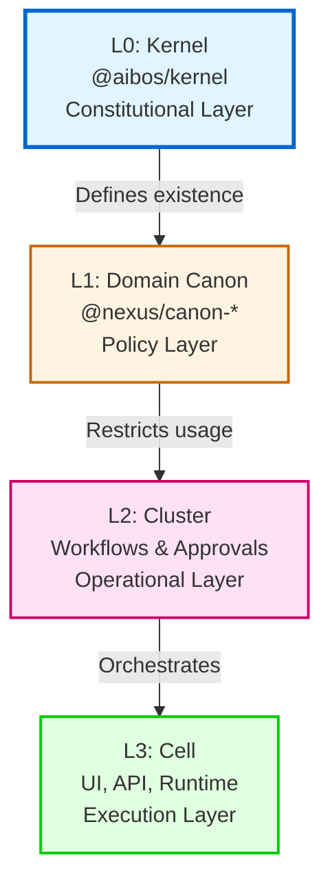

# Layer Model (L0 → L3)

The Kernel implements a four-layer architecture that enforces one-way truth flow from the constitutional layer (L0) to execution layers (L3).

## Overview



## L0: Kernel (Constitutional Layer)

**Package:** `@aibos/kernel`  
**Authority:** Absolute  
**Purpose:** Defines WHAT exists in the platform

### Responsibilities

- Define all concepts (Entity, Attribute, Operation, Relationship)
- Define all value sets and allowed values
- Provide type-safe constants and utilities
- Enforce naming laws and validation rules
- Maintain kernel integrity invariants

### What L0 Defines

- **181 Concepts** - Business objects (INVOICE, VENDOR, CLAIM, etc.)
- **68 Value Sets** - Allowed value collections (CURRENCIES, COUNTRIES, etc.)
- **307 Values** - Actual allowed values (CURRENCY_MYR, COUNTRY_MY, etc.)

### Rules

- ✅ May define new concepts/values (with version bump)
- ❌ May NOT contain domain logic
- ❌ May NOT contain workflow logic
- ❌ May NOT contain tenant-specific logic

### Example

```typescript
import { CONCEPT, VALUE } from "@aibos/kernel";

// ✅ Type-safe concept usage
const invoiceType = CONCEPT.INVOICE; // "CONCEPT_INVOICE"

// ✅ Type-safe value usage
const currency = VALUE.CURRENCIES.MYR; // "CURRENCY_MYR"
```

---

## L1: Domain Canon (Policy Layer)

**Packages:** `@nexus/canon-vendor`, `@nexus/canon-claim`, etc.  
**Authority:** Derived from L0  
**Purpose:** Restricts HOW concepts may be used

### Responsibilities

- Define domain-specific schemas (Zod)
- Define domain-specific status sets
- Define permissions and policies
- Interpret L0 concepts for specific domains

### Rules

- ✅ May restrict L0 concepts (subset, validation)
- ✅ May define domain policies
- ❌ May NOT invent new concepts
- ❌ May NOT redefine L0 semantics

### Example

```typescript
// L1: Domain-specific schema using L0 concepts
import { CONCEPT } from "@aibos/kernel";
import { z } from "zod";

const VendorSchema = z.object({
  type: z.literal(CONCEPT.VENDOR), // Must use L0 concept
  status: z.enum(["ACTIVE", "SUSPENDED"]), // Domain-specific status
});
```

---

## L2: Cluster (Operational Layer)

**Components:** Workflows, Approvals, Orchestration  
**Authority:** Derived from L1  
**Purpose:** Defines operational strategies

### Responsibilities

- Define workflows and approval processes
- Define operational groupings
- Combine L1 domain logic into processes
- Manage state transitions

### Rules

- ✅ May define workflows using L1 schemas
- ✅ May combine multiple domains
- ❌ May NOT rename L0/L1 semantics
- ❌ May NOT modify L0/L1 meaning

### Example

```typescript
// L2: Workflow using L1 schemas
import { VendorSchema } from "@nexus/canon-vendor";

const approvalWorkflow = {
  steps: [
    { action: "SUBMIT", schema: VendorSchema },
    { action: "APPROVE", schema: VendorSchema },
  ],
};
```

---

## L3: Cell (Execution Layer)

**Components:** UI, API, Runtime  
**Authority:** Derived from L2  
**Purpose:** Executes and renders

### Responsibilities

- Execute workflows
- Render UI components
- Handle API requests
- Log and audit operations

### Rules

- ✅ May execute L2 workflows
- ✅ May render UI using L0 concepts
- ❌ May NOT modify any layer semantics
- ❌ Zero authority, full audit

### Example

```typescript
// L3: UI component using L0 concepts
import { CONCEPT, VALUE } from "@aibos/kernel";

function InvoiceForm() {
  return (
    <form>
      <input type="text" data-concept={CONCEPT.INVOICE} />
      <select>
        <option value={VALUE.CURRENCIES.MYR}>MYR</option>
      </select>
    </form>
  );
}
```

---

## Truth Flow Rules

### ✅ Allowed Operations

| Layer | May Do |
|-------|--------|
| L0 | Define concepts, values, identity |
| L1 | Restrict usage, define permissions |
| L2 | Define workflows, approvals |
| L3 | Execute, render, log |

### ❌ Forbidden Operations

| Layer | May NOT Do |
|-------|-----------|
| L0 | N/A (this is the source) |
| L1 | Invent new concepts |
| L2 | Rename semantics |
| L3 | Modify meaning |

## Validation

The kernel provides validation functions to ensure layer compliance:

```typescript
import { validateKernelIntegrity } from "@aibos/kernel";

// Throws if kernel counts don't match expected
validateKernelIntegrity();
```

## Related Documentation

- **[System Architecture Overview](./overview.md)** - C4 Model diagrams
- **[Design Principles](./design-principles.md)** - Core principles
- **[Kernel Contract](../../src/kernel.contract.ts)** - Frozen contract schemas
- **[Getting Started Guide](../guides/getting-started.md)** - Quick start
- **[Usage Guide](../guides/usage.md)** - Layer integration examples
- **[Glossary](../guides/glossary.md)** - Layer terminology

