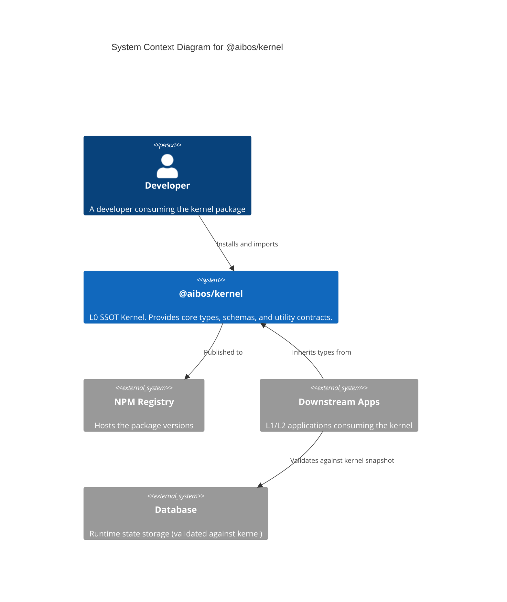
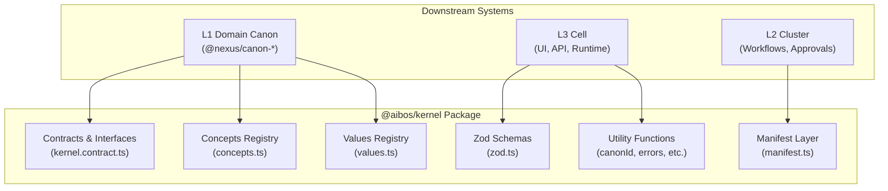
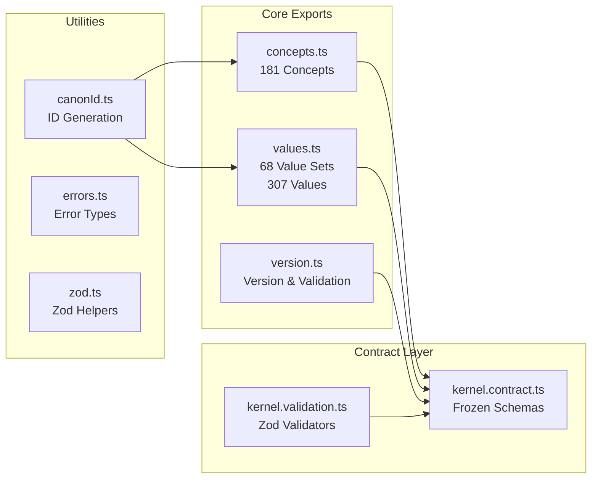
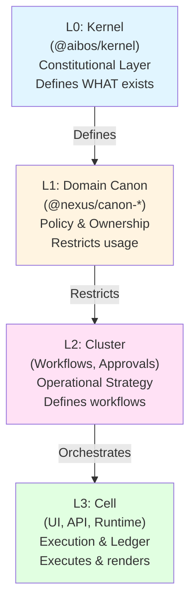
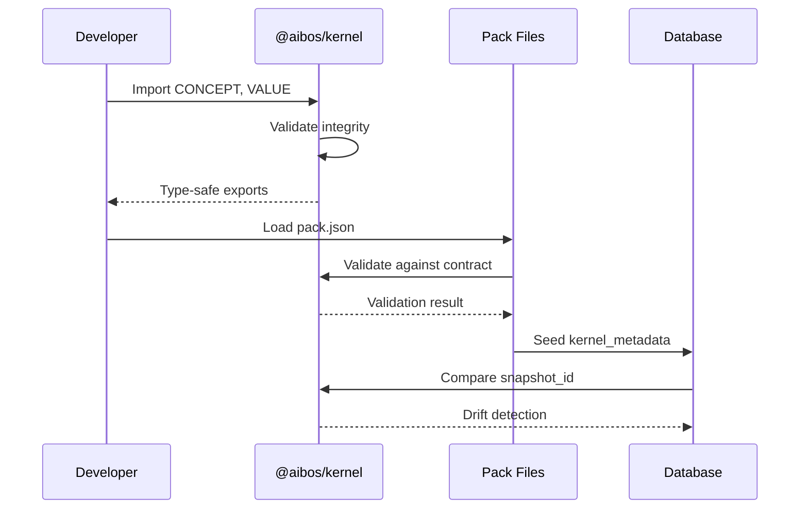

# System Architecture

## Level 1: System Context

The following diagram illustrates how the Kernel interacts with the wider ecosystem.

## Level 2: Container (Module Structure)

Internal high-level structure of the kernel package.

## Level 3: Component (Internal Structure)

Detailed component view of the kernel package.

## Layer Model (L0 → L3)

The kernel implements a four-layer architecture where truth flows one-way.

**Critical Rule:** Truth flows ONE-WAY. Downstream layers may restrict or execute, but **never redefine** what the Kernel defines.

## Data Flow

## Key Principles

1. **Immutable by Default** - Kernel changes require version bumps
2. **Type-Safe** - Zero raw strings, compile-time validation
3. **One-Way Truth** - L0 → L1 → L2 → L3 (never reversed)
4. **Pack-Based** - Modular, parallelizable architecture
5. **Industrialized** - Code generated from data tables

## Technology Stack

- **Language:** TypeScript 5.7+ (strict mode)
- **Validation:** Zod 3.24+
- **Build:** TypeScript Compiler
- **Testing:** Vitest
- **Package Manager:** pnpm

## Related Documentation

- **[Layer Model Details](./layer-model.md)** - Detailed L0/L1/L2/L3 explanation
- **[Design Principles](./design-principles.md)** - Core architectural principles
- **[Architecture Decision Records](../adr/README.md)** - Design decisions
- **[Getting Started Guide](../guides/getting-started.md)** - Quick start
- **[Usage Guide](../guides/usage.md)** - Practical examples
- **[Glossary](../guides/glossary.md)** - Ubiquitous Language

