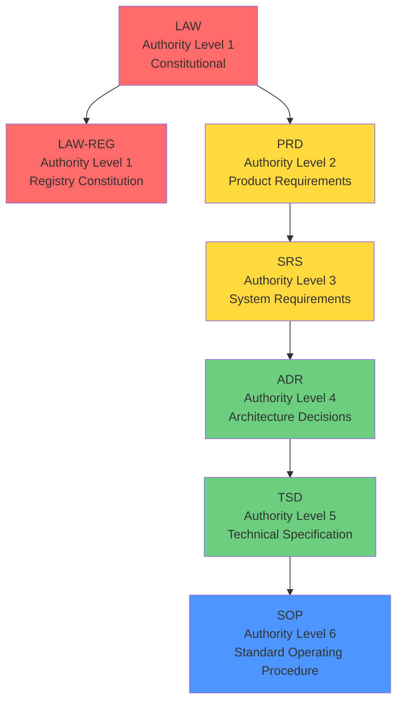

# Document Types System

Complete guide to the document type hierarchy and governance system.

## Overview

The document type system defines a strict authority hierarchy for governance documents: **LAW → PRD → SRS → ADR → TSD → SOP**. This ensures proper governance and prevents circular references.

*See Code:* [`src/document-types.ts`](../../../src/document-types.ts)

## Document Type Hierarchy



## Document Types

### LAW (Law)

**Authority Level:** 1 (Highest)  
**Pattern:** `LAW-XXX`  
**Purpose:** Constitutional philosophy (immutable)  
**Approval Role:** `ROLE_KERNEL_COUNCIL`  
**Immutable on Approval:** ✅ Yes

**Example:** `LAW-001` - Core constitutional law

### LAW-REG (Registry Constitution)

**Authority Level:** 1 (Highest)  
**Pattern:** `LAW-REG-XXX`  
**Purpose:** Registry constitution (immutable, supreme)  
**Approval Role:** `ROLE_KERNEL_COUNCIL`  
**Immutable on Approval:** ✅ Yes  
**Parent:** LAW

**Example:** `LAW-REG-001` - Registry constitution

### PRD (Product Requirements Document)

**Authority Level:** 2  
**Pattern:** `PRD-XXX`  
**Purpose:** Product intent and boundaries  
**Approval Role:** `ROLE_DOMAIN_OWNER`  
**Immutable on Approval:** ❌ No  
**Parent:** LAW

**Example:** `PRD-KERNEL_NPM` - Kernel NPM package requirements

### SRS (System Requirements Specification)

**Authority Level:** 3  
**Pattern:** `SRS-XXX`  
**Purpose:** System obligations and invariants  
**Approval Role:** `ROLE_DOMAIN_OWNER`  
**Immutable on Approval:** ❌ No  
**Parent:** PRD

**Example:** `SRS-KERNEL_VALIDATION` - Kernel validation requirements

### ADR (Architecture Decision Record)

**Authority Level:** 4  
**Pattern:** `ADR-XXX`  
**Purpose:** Architectural choices and rationale  
**Approval Role:** `ROLE_DOMAIN_OWNER`  
**Immutable on Approval:** ✅ Yes  
**Parent:** SRS

**Example:** `ADR-0001` - Record Architecture Decisions

### TSD (Technical Specification Document)

**Authority Level:** 5  
**Pattern:** `TSD-XXX`  
**Purpose:** Concrete technical design  
**Approval Role:** `ROLE_DOCUMENT_AUTHOR`  
**Immutable on Approval:** ❌ No  
**Parent:** ADR

**Example:** `TSD-KERNEL_GENERATION` - Kernel generation specification

### SOP (Standard Operating Procedure)

**Authority Level:** 6 (Lowest)  
**Pattern:** `SOP-XXX`  
**Purpose:** Human execution procedures  
**Approval Role:** `ROLE_DOCUMENT_AUTHOR`  
**Immutable on Approval:** ❌ No  
**Parent:** TSD

**Example:** `SOP-KERNEL_RELEASE` - Kernel release procedure

## Authority Rules

### Reference Rules

- ✅ **Lower-level documents may reference higher-level**
- ❌ **Higher-level documents may NOT reference lower-level**
- ✅ **Same-level documents may reference each other**

### Example

```typescript
// ✅ Valid: ADR references PRD
// ADR-0001: "As per PRD-KERNEL_NPM, we use TypeScript"

// ❌ Invalid: PRD references ADR
// PRD-KERNEL_NPM: "As per ADR-0001..." // FORBIDDEN
```

## Document Status

Documents have lifecycle statuses:

```typescript
type DocumentStatus =
  | "DRAFT"      // Being written
  | "REVIEW"     // Under review
  | "APPROVED"   // Approved and active
  | "DEPRECATED" // Superseded by newer version
  | "WITHDRAWN"; // Withdrawn before approval
```

## Usage

### Getting Document Type

```typescript
import { DOCUMENT_TYPE, DOCUMENT_TYPE_REGISTRY } from "@aibos/kernel";

// Get document type constant
const lawType = DOCUMENT_TYPE.LAW; // "DOCTYPE_LAW"

// Get full definition
const lawDef = DOCUMENT_TYPE_REGISTRY[DOCUMENT_TYPE.LAW];
console.log(lawDef.pattern); // "LAW-XXX"
console.log(lawDef.authorityLevel); // 1
```

### Validating Document References

```typescript
import { DOCUMENT_TYPE_REGISTRY } from "@aibos/kernel";

function canReference(fromType: DocumentTypeId, toType: DocumentTypeId): boolean {
  const from = DOCUMENT_TYPE_REGISTRY[fromType];
  const to = DOCUMENT_TYPE_REGISTRY[toType];
  
  // Lower-level can reference higher-level
  return from.authorityLevel >= to.authorityLevel;
}

// ✅ Valid: ADR (4) references PRD (2)
canReference(DOCUMENT_TYPE.ADR, DOCUMENT_TYPE.PRD); // true

// ❌ Invalid: PRD (2) references ADR (4)
canReference(DOCUMENT_TYPE.PRD, DOCUMENT_TYPE.ADR); // false
```

## Related Documentation

- **[Semantic Roots](./semantic-roots.md)** - Semantic root registry
- **[Namespace Prefixes](./namespace-prefixes.md)** - Namespace prefix system
- **[Architecture Overview](../architecture/overview.md)** - System design
- **[Kernel Doctrine](../../NEXUS_CANON_V5_KERNEL_DOCTRINE.md)** - Core doctrine

---

**Last Updated:** 2026-01-01  
**Source:** [`src/document-types.ts`](../../../src/document-types.ts)

