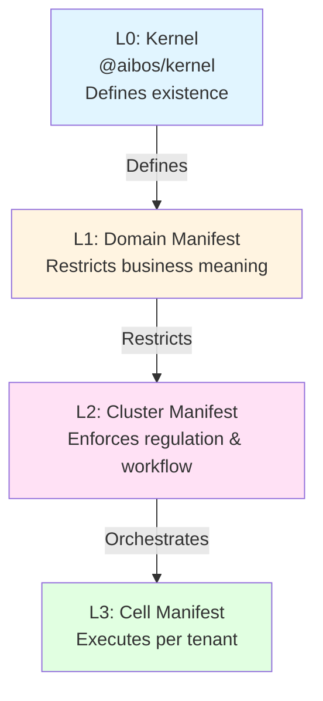

# Manifest Governance System

Complete guide to the manifest system for L1/L2/L3 governance.

## Overview

The manifest system provides runtime governance for L1 (Domain), L2 (Cluster), and L3 (Cell/Tenant) layers. Manifests define concept allowlists and policies that restrict how kernel concepts can be used.

*See Code:* [`src/manifest.ts`](../../../src/manifest.ts)

## Manifest Layers



### L1: Domain Manifest

**Purpose:** Restricts business meaning  
**Target:** Domain (e.g., "VPM", "FINANCE")  
**Authority:** Domain Owner

**Example:**
```typescript
{
  layer: "L1",
  target_type: "domain",
  target_id: "VPM",
  definition: {
    allowlist: [CONCEPT.VENDOR, CONCEPT.CLAIM],
    policies: {
      [CONCEPT.VENDOR]: {
        crud: { create: true, read: true, update: true, delete: false }
      }
    }
  }
}
```

### L2: Cluster Manifest

**Purpose:** Enforces regulation & workflow  
**Target:** Cluster (e.g., "VPM-PROD", "FINANCE-MY")  
**Authority:** Compliance Lead

**Example:**
```typescript
{
  layer: "L2",
  target_type: "cluster",
  target_id: "VPM-PROD",
  definition: {
    allowlist: [CONCEPT.VENDOR, CONCEPT.APPROVAL],
    policies: {
      [CONCEPT.VENDOR]: {
        crud: { create: true, read: true, update: false, delete: false },
        transitions: {
          from: [VALUE.VENDOR_STATUS.DRAFT],
          to: [VALUE.VENDOR_STATUS.APPROVED],
          requiresComment: true
        }
      }
    }
  }
}
```

### L3: Cell Manifest

**Purpose:** Executes per tenant  
**Target:** Tenant (e.g., "tenant-123")  
**Authority:** Tenant Admin

**Example:**
```typescript
{
  layer: "L3",
  target_type: "tenant",
  target_id: "tenant-123",
  definition: {
    allowlist: [CONCEPT.VENDOR],
    policies: {
      [CONCEPT.VENDOR]: {
        crud: { create: true, read: true, update: true, delete: false }
      }
    }
  }
}
```

## Manifest Structure

### Manifest Definition

```typescript
interface ManifestDefinition {
  name: string;                      // Human-readable name
  description?: string;               // Optional description
  allowlist: ConceptId[];            // Allowed concepts (min 1)
  policies?: Record<ConceptId, ConceptPolicy>; // Per-concept policies
  metadata?: Record<string, unknown>; // Extensible metadata
}
```

### Concept Policy

```typescript
interface ConceptPolicy {
  crud: CrudPermission;              // CRUD permissions
  transitions?: StatusTransition[];  // Allowed status transitions
  requiresComment?: boolean;          // Require comment on changes
  metadata?: Record<string, unknown>; // Policy metadata
}
```

### CRUD Permissions

```typescript
interface CrudPermission {
  create: boolean;   // Can create
  read: boolean;     // Can read
  update: boolean;   // Can update
  delete: boolean;   // Can delete (soft-delete only)
}
```

## Full Manifest Schema

The complete manifest as stored in database:

```typescript
interface Manifest {
  id: string;                        // UUID primary key
  layer: ManifestLayer;              // "L1" | "L2" | "L3"
  target_id: string;                 // Domain/cluster/tenant ID
  target_type: TargetType;          // "domain" | "cluster" | "tenant"
  kernel_snapshot_id: string;        // Kernel version compliance
  version: string;                   // Semantic version
  is_active: boolean;                // Is manifest active?
  is_current: boolean;               // Is this current version?
  definition: ManifestDefinition;    // The actual rules
  deleted_at?: string;               // Soft-delete timestamp
  deleted_by?: string;               // Who deleted
  parent_manifest_id?: string;       // Parent manifest (inheritance)
  replaced_by_id?: string;           // Replacement manifest
  created_by?: string;               // Audit fields
  created_at?: string;
  updated_by?: string;
  updated_at?: string;
}
```

## Usage

### Creating a Manifest

```typescript
import { validateManifestCreateInput, CONCEPT } from "@aibos/kernel";

const manifestInput = {
  layer: "L1",
  target_id: "VPM",
  target_type: "domain",
  definition: {
    name: "VPM Domain Manifest",
    description: "Vendor and claim management domain",
    allowlist: [CONCEPT.VENDOR, CONCEPT.CLAIM],
    policies: {
      [CONCEPT.VENDOR]: {
        crud: { create: true, read: true, update: true, delete: false }
      }
    }
  }
};

// Validate input
const manifest = validateManifestCreateInput(manifestInput);
```

### Validating Manifest Definition

```typescript
import { validateManifestDefinition } from "@aibos/kernel";

const definition = {
  name: "My Manifest",
  allowlist: [CONCEPT.INVOICE],
  policies: {
    [CONCEPT.INVOICE]: {
      crud: { create: true, read: true, update: false, delete: false }
    }
  }
};

// Validate definition
const valid = validateManifestDefinition(definition);
```

### Validating Full Manifest

```typescript
import { validateManifest } from "@aibos/kernel";

const manifest = {
  id: "uuid-here",
  layer: "L1",
  target_id: "VPM",
  target_type: "domain",
  kernel_snapshot_id: "sha256:...",
  version: "1.0.0",
  is_active: true,
  is_current: true,
  definition: { ... }
};

// Validate full manifest
const valid = validateManifest(manifest);
```

## Manifest Validation

### Concept Allowlist

- ✅ Only concepts in allowlist can be used
- ✅ Concepts must exist in kernel
- ✅ At least one concept required

### Concept Policies

- ✅ Policies can only reference concepts in allowlist
- ✅ CRUD permissions are boolean flags
- ✅ Status transitions must reference valid values

### Kernel Snapshot Compliance

- ✅ `kernel_snapshot_id` must match current kernel snapshot
- ✅ Prevents using concepts that don't exist in kernel version
- ✅ Enables drift detection

## Inheritance

Manifests can inherit from parent manifests:

```typescript
{
  parent_manifest_id: "parent-uuid",
  definition: {
    // Inherits allowlist and policies from parent
    // Can add additional concepts/policies
    // Cannot remove inherited concepts
  }
}
```

## Related Documentation

- **[Layer Model](../architecture/layer-model.md)** - L0/L1/L2/L3 explanation
- **[Architecture Overview](../architecture/overview.md)** - System design
- **[API Reference](../../api/README.md)** - Manifest API functions
- **[Schema Reference](../../reference/schemas.md)** - Manifest schemas

---

**Last Updated:** 2026-01-01  
**Source:** [`src/manifest.ts`](../../../src/manifest.ts)

