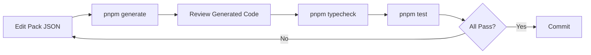

# Development Guide

Complete guide to developing the kernel itself.

## Overview

This guide explains how to develop, modify, and contribute to `@aibos/kernel`. The kernel uses a code generation approach where source of truth is pack JSON files, not hand-written TypeScript.

## Development Workflow

### 1. Setup

```bash
# Clone repository
git clone https://github.com/pohlai88/NEXUS-KERNEL.git
cd NEXUS-KERNEL

# Install dependencies
pnpm install

# Build project
pnpm build

# Validate kernel
pnpm validate:kernel
```

### 2. Development Cycle



**Steps:**

1. **Edit Pack Files** - Modify `packs/*.pack.json` files
2. **Generate Code** - Run `pnpm generate` to regenerate TypeScript
3. **Review Changes** - Check `src/concepts.ts` and `src/values.ts`
4. **Type Check** - Run `pnpm typecheck` to verify types
5. **Test** - Run `pnpm test` to ensure functionality
6. **Commit** - Commit both pack files and generated code

### 3. Making Changes

#### Adding a New Concept

1. **Edit Pack File**
   ```json
   // packs/finance.pack.json
   {
     "concepts": [
       {
         "code": "NEW_CONCEPT",
         "category": "ENTITY",
         "domain": "FINANCE",
         "description": "Description of new concept",
         "tags": ["finance"]
       }
     ]
   }
   ```

2. **Generate Code**
   ```bash
   pnpm generate
   ```

3. **Verify**
   ```bash
   pnpm typecheck
   pnpm test
   ```

4. **Check Generated Code**
   ```typescript
   // src/concepts.ts should now include:
   NEW_CONCEPT: "CONCEPT_NEW_CONCEPT",
   ```

#### Adding a New Value Set

1. **Edit Pack File**
   ```json
   {
     "value_sets": [
       {
         "code": "NEW_VALUE_SET",
         "domain": "FINANCE",
         "description": "Description of value set",
         "jurisdiction": "GLOBAL",
         "metadata": {
           "prefix": "NEW"
         }
       }
     ]
   }
   ```

2. **Add Values**
   ```json
   {
     "values": [
       {
         "code": "VALUE1",
         "value_set_code": "NEW_VALUE_SET",
         "label": "Value 1",
         "description": "Description"
       }
     ]
   }
   ```

3. **Generate and Verify**
   ```bash
   pnpm generate
   pnpm typecheck
   ```

#### Modifying Existing Concepts/Values

**Important:** Only modify concepts/values in the pack that is `authoritative_for` them.

1. **Check Authoritative Pack**
   ```json
   // Check which pack is authoritative
   {
     "authoritative_for": {
       "concepts": ["INVOICE"]
     }
   }
   ```

2. **Edit Authoritative Pack**
   ```json
   // Only edit in the authoritative pack
   {
     "concepts": [
       {
         "code": "INVOICE",
         "description": "Updated description"
       }
     ]
   }
   ```

3. **Generate and Verify**
   ```bash
   pnpm generate
   pnpm validate:kernel
   ```

## Code Generation Process

### What Gets Generated

1. **`src/concepts.ts`**
   - `CONCEPT` constant object
   - `CONCEPT_COUNT` constant
   - `ConceptId` type
   - `CONCEPT_CATEGORY` type

2. **`src/values.ts`**
   - `VALUE` constant object (nested by value set)
   - `VALUESET` constant object
   - `VALUESET_COUNT` constant
   - `VALUE_COUNT` constant
   - `ValueSetId` and `ValueId` types

### Generation Rules

1. **Concept IDs** - Format: `CONCEPT_{CODE}`
   ```typescript
   // Pack: { "code": "INVOICE" }
   // Generated: CONCEPT.INVOICE = "CONCEPT_INVOICE"
   ```

2. **Value Set IDs** - Format: `VALUESET_{JURISDICTION}_{CODE}`
   ```typescript
   // Pack: { "code": "CURRENCIES", "jurisdiction": "GLOBAL" }
   // Generated: VALUESET.CURRENCIES = "VALUESET_GLOBAL_CURRENCIES"
   ```

3. **Value IDs** - Format: `{PREFIX}_{CODE}`
   ```typescript
   // Pack: { "code": "MYR", "value_set_code": "CURRENCIES", prefix: "CURRENCY" }
   // Generated: VALUE.CURRENCIES.MYR = "CURRENCY_MYR"
   ```

## Validation Process

### Pre-Generation Validation

- ✅ Pack structure matches `PackShapeSchema`
- ✅ Concept codes are valid format (UPPERCASE_SNAKE_CASE)
- ✅ Value set codes are valid format
- ✅ Value codes are valid format

### Post-Generation Validation

- ✅ Concept codes are unique
- ✅ Value set codes are unique
- ✅ Value codes are unique within value set
- ✅ All values reference valid value sets
- ✅ Concept categories are valid
- ✅ Domains are valid

### Runtime Validation

```typescript
import { validateKernelIntegrity } from "@aibos/kernel";

// Validates:
// - CONCEPT_COUNT matches actual count
// - VALUESET_COUNT matches actual count
// - VALUE_COUNT matches actual count
validateKernelIntegrity();
```

## Testing

### Running Tests

```bash
# Run all tests
pnpm test

# Watch mode
pnpm test:watch
```

### Test Structure

Tests should cover:
- ✅ Concept/value access
- ✅ Type safety
- ✅ Validation functions
- ✅ Kernel integrity
- ✅ Error handling

### Writing Tests

```typescript
// tests/kernel.test.ts
import { describe, it, expect } from "vitest";
import { CONCEPT, VALUE, validateKernelIntegrity } from "../src";

describe("Kernel", () => {
  it("should have valid concepts", () => {
    expect(CONCEPT.INVOICE).toBe("CONCEPT_INVOICE");
  });

  it("should pass integrity check", () => {
    expect(() => validateKernelIntegrity()).not.toThrow();
  });
});
```

## Release Process

### Pre-Release Checklist

- [ ] All tests pass (`pnpm test`)
- [ ] Type checking passes (`pnpm typecheck`)
- [ ] Kernel validation passes (`pnpm validate:kernel`)
- [ ] Release gate passes (`pnpm release:kernel`)
- [ ] Documentation updated
- [ ] CHANGELOG.md updated

### Release Steps

1. **Run Release Gate**
   ```bash
   pnpm release:kernel
   ```

2. **Create Release**
   ```bash
   # Semantic Release handles:
   # - Version bump
   # - CHANGELOG.md update
   # - Git tag
   # - NPM publish
   pnpm release
   ```

## Common Development Tasks

### Adding a New Domain

1. **Create Pack File**
   ```bash
   # Create packs/new-domain.pack.json
   ```

2. **Define Domain Concepts**
   ```json
   {
     "id": "new-domain",
     "domain": "NEW_DOMAIN",
     "concepts": [...]
   }
   ```

3. **Add Domain to Schema**
   ```typescript
   // src/kernel.contract.ts
   export const DomainSchema = z.enum([
     // ... existing domains
     "NEW_DOMAIN",
   ]);
   ```

4. **Generate and Test**
   ```bash
   pnpm generate
   pnpm validate:kernel
   ```

### Modifying Kernel Contract

**Warning:** Changes to `kernel.contract.ts` are breaking changes and require major version bump.

1. **Update Schema**
   ```typescript
   // src/kernel.contract.ts
   export const ConceptShapeSchema = z.object({
     // ... existing fields
     newField: z.string().optional(),
   });
   ```

2. **Update Generator**
   ```typescript
   // scripts/generate-kernel.ts
   // Update generation logic to handle new field
   ```

3. **Update Packs**
   - Update all pack files to include new field (if required)
   - Or ensure field is optional

4. **Test**
   ```bash
   pnpm generate
   pnpm validate:kernel
   ```

## Debugging

### Generation Issues

**Problem:** Generation fails with validation error

**Debug:**
```bash
# Check pack structure
cat packs/problematic.pack.json | jq

# Validate against schema
pnpm generate
# Read error message for specific issue
```

**Common Issues:**
- Invalid concept code format
- Duplicate concept codes
- Value references non-existent value set
- Invalid domain code

### Type Errors

**Problem:** TypeScript errors after generation

**Debug:**
```bash
# Check generated code
cat src/concepts.ts | head -50

# Type check with verbose output
pnpm typecheck
```

**Common Issues:**
- Generated code syntax errors
- Type mismatches
- Missing exports

### Test Failures

**Problem:** Tests fail after changes

**Debug:**
```bash
# Run tests with verbose output
pnpm test --reporter=verbose

# Check specific test
pnpm test kernel.test.ts
```

## Best Practices

### 1. Always Generate Before Committing

```bash
# Before commit
pnpm generate
pnpm validate:kernel
git add packs/ src/concepts.ts src/values.ts
git commit
```

### 2. Never Edit Generated Files Manually

❌ **Don't:**
```typescript
// src/concepts.ts (GENERATED - DO NOT EDIT)
export const CONCEPT = {
  INVOICE: "CONCEPT_INVOICE",
  // Don't add manual entries here
};
```

✅ **Do:**
```json
// packs/finance.pack.json
{
  "concepts": [
    { "code": "INVOICE", ... }
  ]
}
```

### 3. Use Pack Priority Correctly

- Core pack: priority 100
- Standard packs: priority 10
- Extension packs: priority 5
- Custom packs: priority 1

### 4. Declare Authoritative For

```json
{
  "authoritative_for": {
    "concepts": ["INVOICE"],
    "value_sets": ["CURRENCIES"]
  }
}
```

Prevents accidental overwrites.

### 5. Follow Naming Conventions

- Pack ID: `lowercase-kebab-case`
- Concept code: `UPPERCASE_SNAKE_CASE`
- Value set code: `UPPERCASE_SNAKE_CASE`
- Value code: `UPPERCASE_SNAKE_CASE`

## Related Documentation

- **[Packs Guide](./packs.md)** - Pack structure and format
- **[Scripts Guide](./scripts.md)** - Script documentation
- **[Contributing Guidelines](../governance/contributing.md)** - Contribution process
- **[Code Standards](../governance/code-standards.md)** - Coding conventions

---

**Last Updated:** 2026-01-01  
**Source:** Development workflow and best practices

