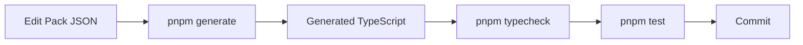
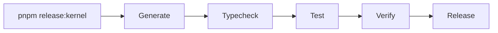

# Scripts Guide

Complete guide to all scripts in the kernel project.

## Overview

The kernel uses several scripts for code generation, validation, and release. All scripts are in the `scripts/` directory and can be run via `package.json` commands.

## Available Scripts

### Build & Development

| Command | Script | Purpose |
|---------|--------|---------|
| `pnpm build` | `tsc -p tsconfig.build.json` | Compile TypeScript to JavaScript |
| `pnpm typecheck` | `tsc -p tsconfig.json --noEmit` | Type check without emitting files |
| `pnpm test` | `vitest run` | Run test suite |
| `pnpm dev` | `build && dev-server.js` | Build and start dev server |

### Code Generation

| Command | Script | Purpose |
|---------|--------|---------|
| `pnpm generate` | `scripts/generate-kernel.ts` | Generate kernel code from packs |
| `pnpm generate:watch` | `tsx watch scripts/generate-kernel.ts` | Watch mode for generation |

### Documentation

| Command | Script | Purpose |
|---------|--------|---------|
| `pnpm docs:generate` | `typedoc` | Generate API documentation |
| `pnpm docs:schema` | `scripts/generate-schema-docs.ts` | Generate schema reference |
| `pnpm docs:dev` | `vitepress dev docs` | Start documentation dev server |
| `pnpm docs:build` | `vitepress build docs` | Build documentation site |

### Release

| Command | Script | Purpose |
|---------|--------|---------|
| `pnpm release:kernel` | `scripts/release-kernel.ts` | Release gate validation |
| `pnpm release` | `semantic-release` | Automated release |
| `pnpm changelog:generate` | `scripts/generate-changelog.ts` | Generate changelog |

### Validation

| Command | Script | Purpose |
|---------|--------|---------|
| `pnpm validate:kernel` | `generate && typecheck && test` | Full kernel validation |

---

## Script Details

### 1. `generate-kernel.ts` - Kernel Code Generator

**Purpose:** Generates TypeScript code (`concepts.ts`, `values.ts`) from pack JSON files.

**How it works:**

1. **Load Packs**
   ```typescript
   // Reads all .pack.json files from packs/ directory
   const packs = loadPacks();
   ```

2. **Merge Packs**
   ```typescript
   // Merges packs by priority
   // Higher priority packs override lower priority
   const { concepts, valueSets, values } = mergePacks(packs);
   ```

3. **Validate Invariants**
   ```typescript
   // Ensures:
   // - No duplicate concept codes
   // - No duplicate value set codes
   // - All values reference valid value sets
   validateGeneratorInvariants(concepts, valueSets, values);
   ```

4. **Generate TypeScript**
   ```typescript
   // Generates concepts.ts with CONCEPT constants
   const conceptsCode = generateConcepts(concepts);
   
   // Generates values.ts with VALUE constants
   const valuesCode = generateValues(valueSets, values);
   ```

5. **Write Files**
   ```typescript
   // Writes to src/concepts.ts and src/values.ts
   writeFileSync("src/concepts.ts", conceptsCode);
   writeFileSync("src/values.ts", valuesCode);
   ```

**Usage:**
```bash
pnpm generate
```

**Output:**
- `src/concepts.ts` - Generated concept constants
- `src/values.ts` - Generated value set and value constants

**Validation:**
- Pack structure validation (Zod schemas)
- Concept code uniqueness
- Value set code uniqueness
- Value code uniqueness within value set
- Value-to-value-set reference validation

**Error Handling:**
- Stops on first error
- Reports which pack/file caused the error
- Provides validation error details

---

### 2. `release-kernel.ts` - Release Gate

**Purpose:** One-command release validation to prevent "it works on my machine" drift.

**How it works:**

1. **Generate Kernel**
   ```bash
   pnpm generate
   ```
   - Ensures code is up-to-date with packs

2. **Type Check**
   ```bash
   pnpm typecheck
   ```
   - Validates TypeScript compilation
   - Catches type errors

3. **Run Tests**
   ```bash
   pnpm test
   ```
   - Runs test suite
   - Ensures functionality works

4. **Verify Output**
   - Checks `src/concepts.ts` exists
   - Checks `src/values.ts` exists
   - Extracts and displays kernel statistics

**Usage:**
```bash
pnpm release:kernel
```

**Output:**
```
🚀 Kernel Release Gate
━━━━━━━━━━━━━━━━━━━━━━━━━━━━━━━━━━━━━━━━━━━━━━━━━━━━━━━━━━━━━━━━

Generating kernel code...
✅ Generating kernel code passed

Type checking...
✅ Type checking passed

Running tests...
✅ Running tests passed

📊 Kernel Statistics:
   Concepts: 181
   Value Sets: 68
   Values: 307

✨ Release gate passed - kernel is production-ready!
```

**When to use:**
- Before committing changes
- Before creating a release
- In CI/CD pipeline
- Before deploying

---

### 3. `generate-changelog.ts` - Changelog Generator

**Purpose:** Generates changelog entries from pack changes.

**How it works:**

1. **Load Packs**
   - Reads all pack files
   - Compares versions

2. **Generate Entry**
   - Creates changelog entry for pack changes
   - Formats according to Keep a Changelog

**Usage:**
```bash
pnpm changelog:generate
```

**Note:** This is a helper script. Main changelog generation is handled by Semantic Release.

---

### 4. `generate-schema-docs.ts` - Schema Documentation Generator

**Purpose:** Auto-generates schema reference from Zod schemas.

**How it works:**

1. **Extract Schema Info**
   ```typescript
   // Reads Zod schemas from kernel.contract.ts
   const schemas = [
     ConceptCategorySchema,
     DomainSchema,
     ConceptShapeSchema,
     ValueSetShapeSchema,
     ValueShapeSchema,
     PackShapeSchema,
     KernelRegistryShapeSchema,
   ];
   ```

2. **Generate Markdown**
   ```typescript
   // Extracts:
   // - Schema type (enum, object, etc.)
   // - Fields and types
   // - Required/optional status
   // - Descriptions
   const markdown = generateSchemaDocs();
   ```

3. **Write Output**
   ```typescript
   // Writes to docs/reference/schemas.md
   writeFileSync("docs/reference/schemas.md", markdown);
   ```

**Usage:**
```bash
pnpm docs:schema
```

**Output:**
- `docs/reference/schemas.md` - Auto-generated schema reference

**Features:**
- Extracts field types from Zod schemas
- Identifies required vs optional fields
- Documents enum values
- Includes usage examples

---

### 5. `dev-server.js` - Development Server

**Purpose:** Development server for testing kernel functionality.

**How it works:**
- Starts a development server
- Allows testing kernel exports
- Provides hot reload during development

**Usage:**
```bash
pnpm dev
# or
pnpm dev:server
```

**Note:** This is a simple Node.js server for development purposes.

---

## Script Execution Flow

### Development Workflow



### Release Workflow



## Script Dependencies

| Script | Dependencies |
|--------|--------------|
| `generate-kernel.ts` | `kernel.contract.ts`, `kernel.validation.ts`, `zod` |
| `release-kernel.ts` | `generate-kernel.ts`, TypeScript, Vitest |
| `generate-changelog.ts` | `kernel.contract.ts`, pack files |
| `generate-schema-docs.ts` | `kernel.contract.ts`, `zod` |
| `dev-server.js` | Node.js, compiled kernel |

## Troubleshooting

### Script Fails with "Cannot find module"

**Cause:** Dependencies not installed or TypeScript not compiled.

**Solution:**
```bash
pnpm install
pnpm build
```

### Generation Fails with Validation Error

**Cause:** Pack structure invalid or conflicts detected.

**Solution:**
- Check pack JSON structure
- Verify concept/value codes are unique
- Check pack priorities
- Review error message for specific issue

### Type Check Fails After Generation

**Cause:** Generated code has type errors.

**Solution:**
- Check pack data for invalid values
- Verify concept/value codes match naming conventions
- Review TypeScript errors for specific issues

## Related Documentation

- **[Packs Guide](./packs.md)** - Pack structure and format
- **[Development Guide](./development.md)** - Development workflow
- **[Schema Reference](../reference/schemas.md)** - Schema definitions
- **[Kernel Contract](../../src/kernel.contract.ts)** - Source schemas

---

**Last Updated:** 2026-01-01  
**Source:** [`scripts/`](../../scripts/) directory

